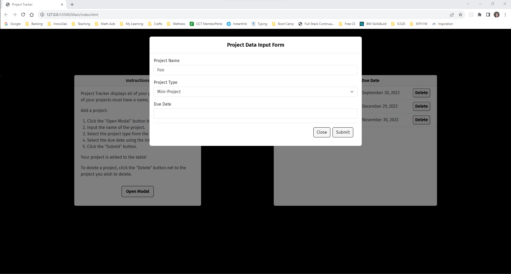
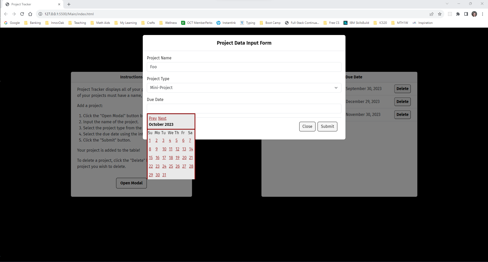
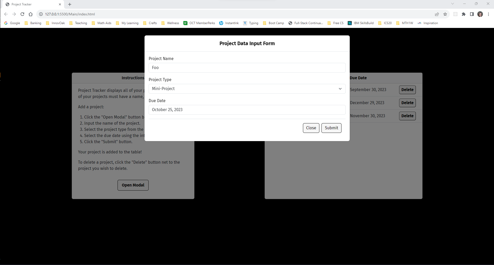
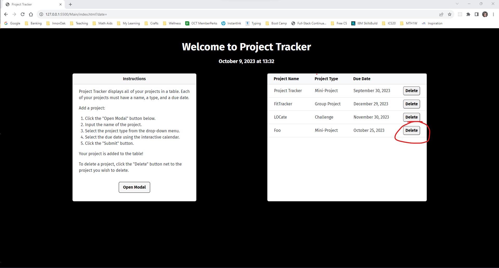
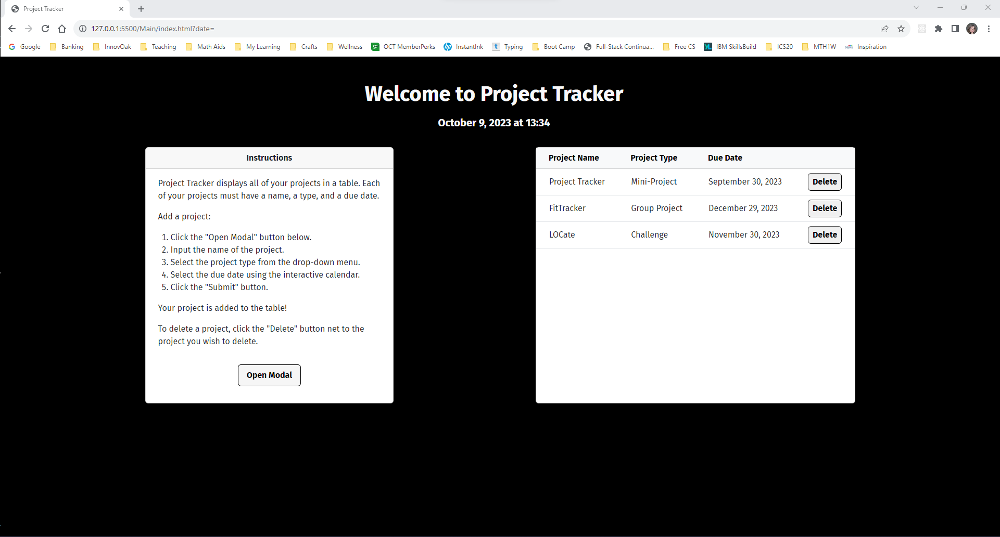

# Project-Tracker

This application enables bootcamp students to keep track of their projectsby allowing them to input, store, delete, and view their projects. The application is powered by JavaScript/jQuery code that dynamically updates HTML and CSS. The application also uses Bootstrap for styling.

## Table of Contents

* [Installation](#installation)
* [Usage](#usage)
* [License](#license)
  
  
## Installation

The project is deployed via GitHub Pages.

## Usage

When you start the application, you will be presented with instructions for using the application and a table of all saved projects.

To add a project, click the "Open Modal" button to reveal the project input form.
  

Input the name of the project in the "Project Name" input field.

Select one of the three project types from the drop-down menu.

Select the project due date from the interactive calendar..

Click the submit button to save the project.

The project is added to the table.

To delete a project, cliick the "Delete" button next to the project to be deleted.

The project is deleted from storage and remived from the table.

## License
This project is licensed under the terms of the MIT license.

##

![HTML]https://img.shields.io/badge/HTML-239120?style=for-the-badge&logo=html5&logoColor=white ![CSS]https://img.shields.io/badge/CSS-239120?&style=for-the-badge&logo=css3&logoColor=white ![JavaScript]https://img.shields.io/badge/JavaScript-F7DF1E?style=for-the-badge&logo=javascript&logoColor=black ![jQuery]https://img.shields.io/badge/jQuery-0769AD?style=for-the-badge&logo=jquery&logoColor=white ![Bootstrap]https://img.shields.io/badge/Bootstrap-563D7C?style=for-the-badge&logo=bootstrap&logoColor=white 
  
 
